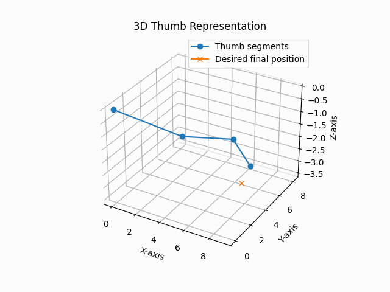
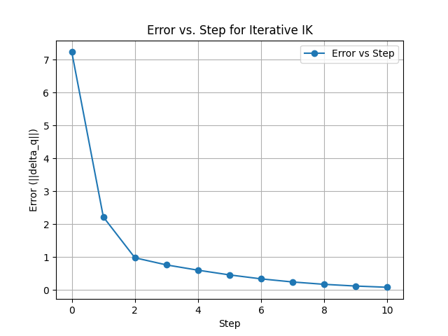

Sample thumb movement path calculated by the algorithm. The points were randomly generated in the 3D space reachable by the average human thumb. The 'most optimal' path is defined as the path that minimizes the sum of all angle changes in the thumb's five degrees of freedom. 

Included below is a sample error plot over time that depicts the distance between the thumb tip's current position and the desired final position approaching the tolerance $\epsilon=0.1 mm$ as the iterative algorithm progresses. 

